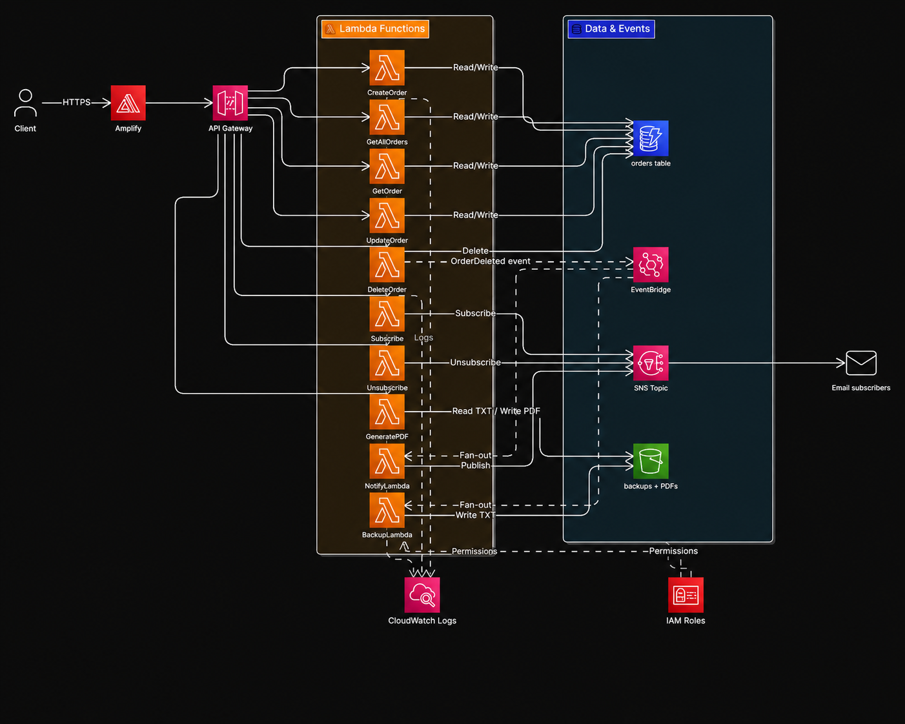

# Serverless Order Management System

An event-driven order management platform built entirely on AWS managed services — no servers,
no containers, nothing to patch or scale. A static web client talks to API Gateway, every endpoint
is backed by its own Lambda, orders live in DynamoDB, and deleting an order publishes an event
that fans out to email notification and S3 backup in parallel.



## How it works

The interesting part is the delete path. `DeleteOrder` doesn't send the email or write the backup
itself — it removes the row and publishes an `OrderDeleted` event to EventBridge, then returns.
EventBridge fans that event out to two Lambdas that run in parallel and independently:

- **NotifyLambda** publishes to an SNS topic, which emails every confirmed subscriber
- **BackupLambda** writes the deleted order as a TXT object under `deleted-orders/` in S3

So the API responds immediately instead of blocking on its own side effects, and adding a third
consumer later means adding an EventBridge target — not editing `DeleteOrder`.

`GeneratePDF` reads every backup object out of S3, renders a summary PDF with `fpdf`, uploads it,
and returns a **pre-signed URL** valid for a limited window. The file never travels through
API Gateway, which sidesteps the payload size limit entirely.

## Services used

| Service | Role |
|---|---|
| **API Gateway** | REST API, Lambda proxy integration, CORS |
| **Lambda** | 13 Python functions — one per endpoint plus the two event consumers |
| **DynamoDB** | `orders` table, `orderId` (UUID) partition key, on-demand capacity |
| **EventBridge** | Decouples the delete flow; fans `OrderDeleted` out to two targets |
| **SNS** | Email notifications with subscribe / unsubscribe and confirmation |
| **S3** | Deleted-order backups and generated PDF summaries |
| **Amplify** | Hosts the static web client over HTTPS |
| **CloudWatch Logs** | Logs and traces for every function |
| **IAM** | Execution role scoped to the services each function actually touches |
| **Comprehend / Translate** | Sentiment scoring and translation of order text |

## API

| Method | Path | Purpose |
|---|---|---|
| `POST` | `/orders` | Create an order |
| `GET` | `/orders` | List all orders, sorted by creation date |
| `GET` | `/orders/{orderId}` | Fetch one order |
| `PUT` | `/orders/{orderId}` | Update order status |
| `DELETE` | `/orders/{orderId}` | Delete an order and publish `OrderDeleted` |
| `POST` | `/subscribe` | Subscribe an email to notifications |
| `POST` | `/unsubscribe` | Unsubscribe an email |
| `GET` | `/generate-pdf` | Build the deleted-orders PDF, return a pre-signed URL |
| `GET` | `/stats` | Live order count, revenue and status breakdown |

## Layout

```
Lambdas/       one Python file per function, deployed as a zip each
client/        single-page HTML/JS client (no build step)
docs/          write-up, architecture notes and tested-flow screenshots
deploy.ps1     AWS CLI script wiring a Lambda to an API Gateway route
```

## Running it yourself

Both DynamoDB and the Lambda code are region- and account-agnostic; the only account-specific
values are the SNS topic ARN and the S3 bucket name, which are read from Lambda environment
variables. Copy `.env.example` to see the shape and set them on the relevant functions.

`deploy.ps1` shows the AWS CLI pattern used throughout — creating a method, attaching an
`AWS_PROXY` integration, granting API Gateway permission to invoke the function, and redeploying
the stage. It resolves the account id at runtime via `sts get-caller-identity`, so nothing
account-specific is hardcoded.

## Notes and limitations

This was built on **AWS Academy Learner Lab**, which shapes a few decisions:

- Lambdas use the pre-existing `LabRole` rather than a purpose-built execution role. In a real
  account each function would get its own role with only the actions it uses.
- The API is deployed with `--authorization-type NONE`. Fine for a graded demo where the endpoint
  is short-lived; anything real needs Cognito, an API key, or IAM auth in front of it.
- The `orders` table has no sort key, so "all orders by date" is a `Scan` sorted in the Lambda.
  That's fine at assignment scale and wrong at any real volume — a GSI on `createdAt` is the fix.
- `AnalyzeSentiment` and `TranslateOrder` are written and deployed, but not yet wired to routes
  in the client.

The AWS resources behind the URLs in `docs/` no longer exist — the lab environment has since been
torn down.
