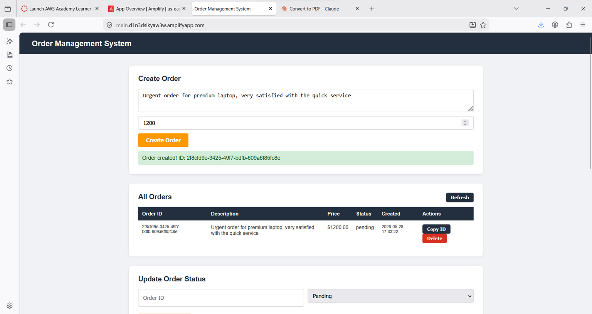
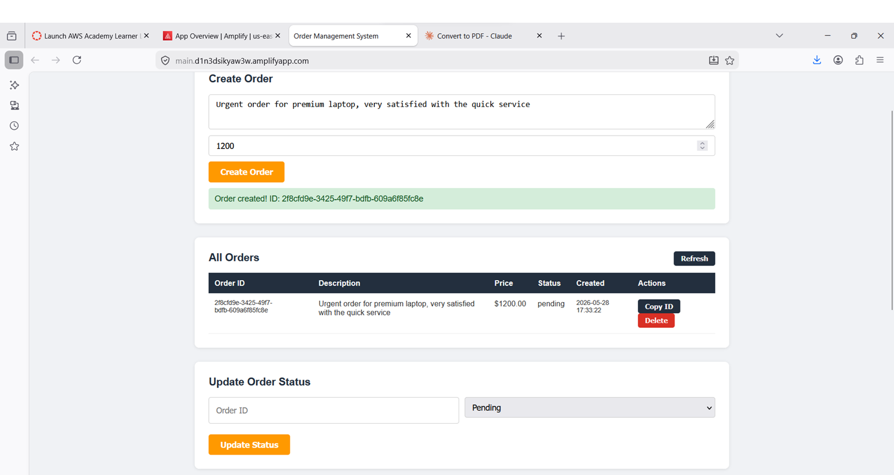
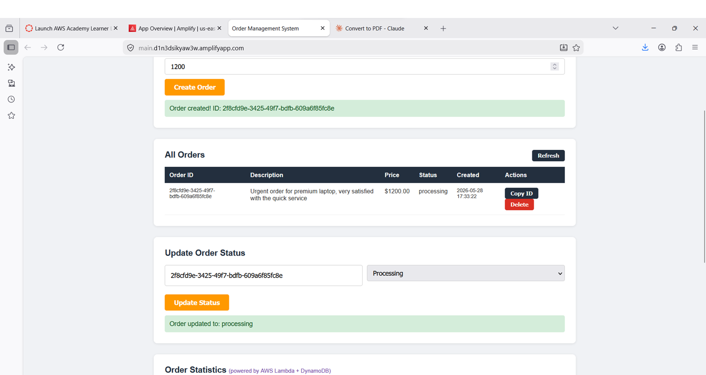
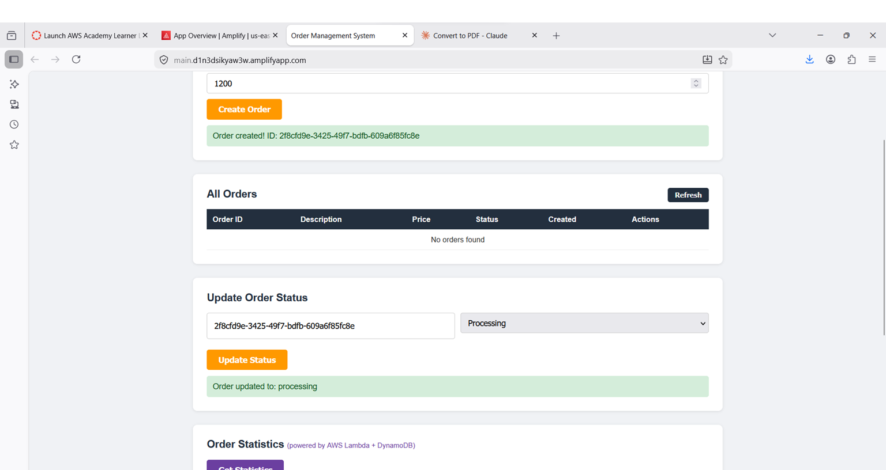
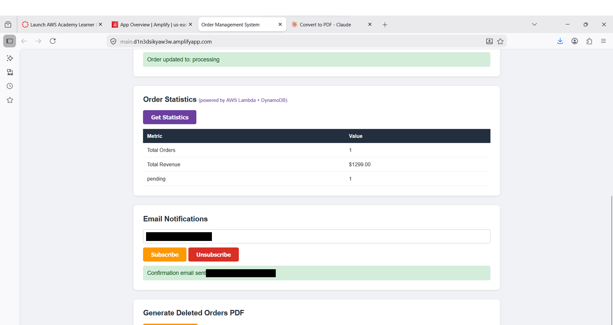
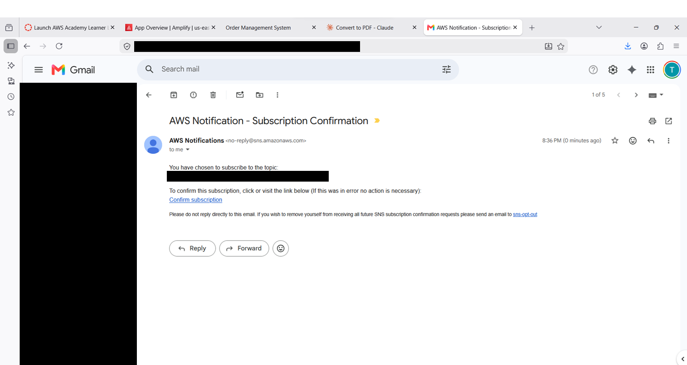
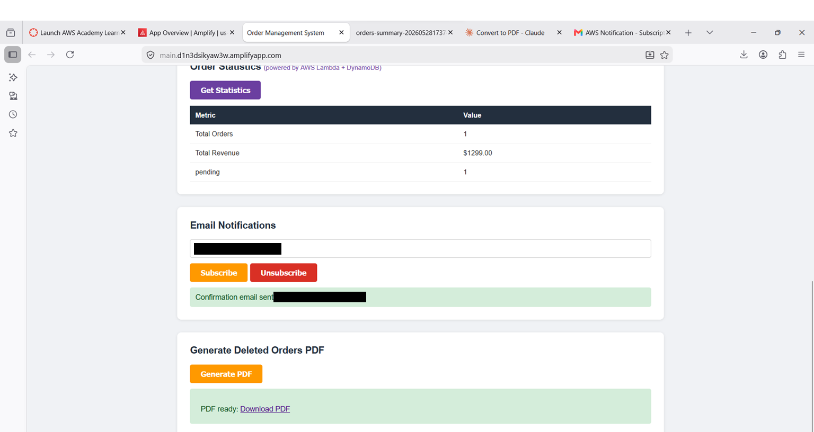
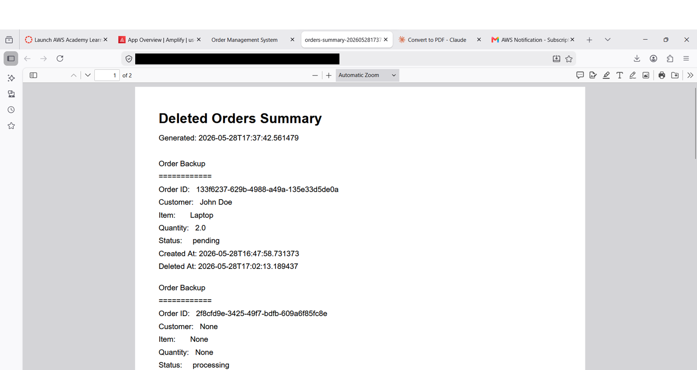
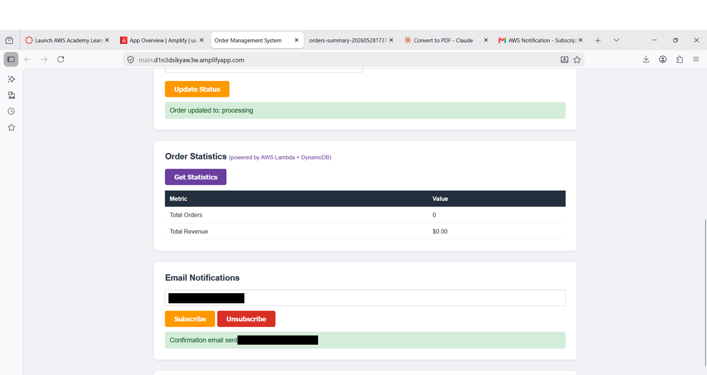

# Final Project – Event-Driven Serverless Order Management System

---

## AWS Diagram


**Explanation:**
The system is a fully serverless, event-driven order management platform built on AWS. The web client (HTML/JS) is hosted on AWS Amplify and communicates with a REST API exposed via API Gateway. Each API endpoint triggers a dedicated AWS Lambda function. Order data is stored persistently in DynamoDB. When an order is deleted, the DeleteOrder Lambda publishes an event to Amazon EventBridge, which fans out asynchronously to two targets: NotifyLambda (which sends an email notification via SNS) and BackupLambda (which saves the deleted order as a TXT file in S3). A separate GeneratePDF Lambda reads all TXT files from S3 and returns a pre-signed URL to a PDF summary. An OrderStats Lambda provides real-time order statistics by querying DynamoDB directly.

---

## AWS Setup per Service

| AWS Service | Why did you choose this service? | CLI Command to verify |
|---|---|---|
| Amazon DynamoDB | NoSQL database chosen for its serverless, on-demand scaling and low-latency key-value access. Used to store all order data persistently. orderId (UUID) is the partition key — each order is uniquely identified, no sort key is needed. Sorting by creation date is handled in Lambda, which is sufficient at this scale. | `aws dynamodb describe-table --table-name orders --region us-east-1` |
| AWS Lambda | Serverless compute chosen to implement all business logic without managing servers. Each API operation maps to a dedicated Lambda function for separation of concerns. | `aws lambda list-functions --region us-east-1` |
| Amazon API Gateway | Managed REST API service chosen to expose all Lambda functions as HTTP endpoints. Handles routing, CORS, and request forwarding to Lambda via proxy integration. | `aws apigateway get-rest-apis --region us-east-1` |
| Amazon SNS | Pub/Sub messaging service chosen to send email notifications to subscribed users when an order is deleted. Supports subscribe/unsubscribe via API. | `aws sns list-topics --region us-east-1` |
| Amazon EventBridge | Event bus chosen to decouple the DeleteOrder flow. When an order is deleted, an event is published to EventBridge which fans out asynchronously to NotifyLambda and BackupLambda in parallel, without blocking the delete response. | `aws events list-rules --region us-east-1` |
| Amazon S3 | Object storage chosen to store deleted order backups as TXT files and generated PDF summaries. Pre-signed URLs allow secure temporary access to PDF files. | `aws s3 ls --region us-east-1` |
| AWS Amplify | Hosting service chosen to deploy the web client (HTML/JS). Provides a public HTTPS URL and simple deployment via drag-and-drop. | `aws amplify list-apps --region us-east-1` |

---

## APIs List

| API Name | HTTP Method | API URL | Sample Input | Sample Output |
|---|---|---|---|---|
| Create Order | POST | https://y7zcu18r70.execute-api.us-east-1.amazonaws.com/prod/orders | `{"description": "Premium laptop order", "price": 1299}` | `{"orderId": "abc-123", "message": "Order created"}` |
| Get All Orders | GET | https://y7zcu18r70.execute-api.us-east-1.amazonaws.com/prod/orders | — | `[{"orderId": "abc-123", "description": "Premium laptop order", "price": "1299", "status": "pending", "createdAt": "2026-05-28T17:12:03", "lastModifiedAt": "2026-05-28T17:12:03"}]` |
| Get Order | GET | https://y7zcu18r70.execute-api.us-east-1.amazonaws.com/prod/orders/{orderId} | URL: `/orders/abc-123` | `{"orderId": "abc-123", "description": "Premium laptop order", "price": "1299", "status": "pending", "createdAt": "2026-05-28T17:12:03", "lastModifiedAt": "2026-05-28T17:12:03"}` |
| Update Order | PUT | https://y7zcu18r70.execute-api.us-east-1.amazonaws.com/prod/orders/{orderId} | `{"status": "shipped"}` | `{"orderId": "abc-123", "status": "shipped", "lastModifiedAt": "2026-05-28T18:00:00"}` |
| Delete Order | DELETE | https://y7zcu18r70.execute-api.us-east-1.amazonaws.com/prod/orders/{orderId} | URL: `/orders/abc-123` | `{"message": "Order deleted", "orderId": "abc-123"}` |
| Subscribe | POST | https://y7zcu18r70.execute-api.us-east-1.amazonaws.com/prod/subscribe | `{"email": "user@example.com"}` | `{"message": "Confirmation email sent to user@example.com"}` |
| Unsubscribe | POST | https://y7zcu18r70.execute-api.us-east-1.amazonaws.com/prod/unsubscribe | `{"email": "user@example.com"}` | `{"message": "user@example.com unsubscribed successfully"}` |
| Generate PDF | GET | https://y7zcu18r70.execute-api.us-east-1.amazonaws.com/prod/generate-pdf | — | `{"url": "https://orders-backup-....s3.amazonaws.com/summaries/orders-summary-....pdf?..."}` |
| Order Statistics | GET | https://y7zcu18r70.execute-api.us-east-1.amazonaws.com/prod/stats | — | `{"totalOrders": 3, "totalRevenue": 3897.00, "byStatus": {"pending": 2, "shipped": 1}}` |

---

## Client URL

**Web Application URL:** https://main.d1n3dsikyaw3w.amplifyapp.com/

The web application is hosted on AWS Amplify and accessible publicly. It supports all required operations via real API calls to the backend.

---

## List of Tested Flows

### 1. Create Order
- Entered description and price in the Create Order form
- Clicked "Create Order"
- Result: success message with orderId displayed, order appears in All Orders table



### 2. Get All Orders
- Clicked "Refresh" in the All Orders section
- Result: all orders displayed in a table sorted by creation date



### 3. Get Specific Order
- Used "Copy ID" button to copy an orderId from the All Orders table
- The order details are displayed in the table including description, price, status and creation date

### 4. Update Order Status
- Copied an orderId, pasted into the Update Order Status field
- Selected "shipped" from the dropdown
- Clicked "Update Status"
- Result: order status updated, table refreshed showing new status and updated lastModifiedAt



### 5. Delete Order + EventBridge Fan-out
- Clicked "Delete" on an order in the table
- Result: order removed from table immediately (asynchronous flow does not block response)
- EventBridge triggered NotifyLambda (SNS email) and BackupLambda (S3 TXT file) in parallel



### 6. Subscribe to Notifications
- Entered email address in the Email Notifications section
- Clicked "Subscribe"
- Result: confirmation email received from AWS SNS — clicked confirm link to activate





### 7. Unsubscribe from Notifications
- Entered same email address
- Clicked "Unsubscribe"
- Result: unsubscribed successfully message

### 8. Generate PDF
- Clicked "Generate PDF"
- Result: download link returned — PDF contains all deleted order details from S3





### 9. Order Statistics (Freestyle)
- Clicked "Get Statistics"
- Result: table showing total orders, total revenue, and breakdown by status



---

## Freestyle Enhancement Explanation

**Service used:** AWS Lambda + Amazon DynamoDB  
**Feature:** Order Statistics Dashboard

The Order Statistics feature adds a dedicated `OrderStats` Lambda function that scans the DynamoDB `orders` table and computes real-time metrics:
- Total number of active orders
- Total revenue across all orders
- Breakdown of orders by status (pending, processing, shipped, delivered)

**Why this was selected:** It adds clear business value to the order management system by giving operators a live dashboard view of their orders without needing to manually count or export data. It demonstrates a serverless analytics pattern using existing infrastructure.

**How to use:** In the web client, scroll to the "Order Statistics" section and click "Get Statistics". The results are displayed immediately in a table.

**How to verify:** Create several orders with different statuses (use Update Order to change them), then click "Get Statistics" to see the counts and revenue update in real time.


---

## Delete Order Lambda Code

```python
import json
import boto3
from decimal import Decimal

dynamodb = boto3.resource('dynamodb')
table = dynamodb.Table('orders')
events = boto3.client('events')

def lambda_handler(event, context):
    order_id = event['pathParameters']['orderId']

    result = table.get_item(Key={'orderId': order_id})
    if 'Item' not in result:
        return {
            'statusCode': 404,
            'headers': {'Access-Control-Allow-Origin': '*'},
            'body': json.dumps({'message': 'Order not found'})
        }

    order = result['Item']
    table.delete_item(Key={'orderId': order_id})

    events.put_events(Entries=[{
        'Source': 'myapp.orders',
        'DetailType': 'OrderDeleted',
        'Detail': json.dumps(order, default=lambda x: float(x) if isinstance(x, Decimal) else str(x)),
        'EventBusName': 'default'
    }])

    return {
        'statusCode': 200,
        'headers': {'Access-Control-Allow-Origin': '*'},
        'body': json.dumps({'message': 'Order deleted', 'orderId': order_id})
    }
```
